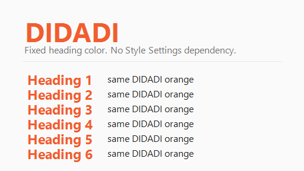

# DIDADI

All heading levels, from H1 through H6, use the same orange heading color by default. DIDADI is a focused writing theme with warm neutral backgrounds, a vivid orange accent, readable contrast in light and dark modes, and a calm note-first interface. It includes a 512 by 288 cover screenshot for the community theme gallery. No extra configuration is required.
